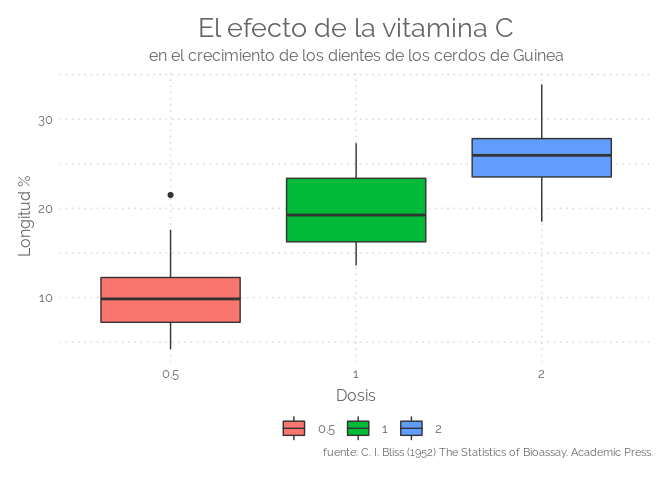
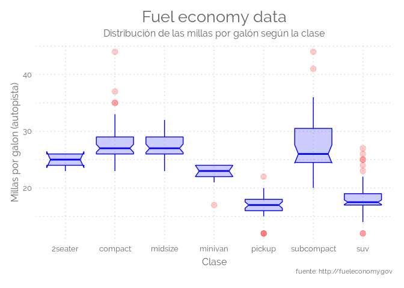

Hace un tiempo que estoy robando ideas de todos lados como para armar un tema de **ggplot2** que sea elegante, simple y visualmente atractivo. Lo llame `theme_elegante()`, muy original lo mio. El código es el siguiente:

``` r
#######################
# CREATING PLOT THEMES
#######################
library(extrafont)

# Create Base Theme
#------------------
theme_elegante <- function(base_size = 10,
                           base_family = "Raleway"
                           )
    {
    color.background = "#FFFFFF" # Chart Background
    color.grid.major = "#D9D9D9" # Chart Gridlines
    color.axis.text = "#666666" # 
    color.axis.title = "#666666" # 
    color.title = "#666666"
    color.subtitle = "#666666"
    strip.background.color = '#9999CC'
    
    ret <-
        theme_bw(base_size=base_size) +
        
        # Set the entire chart region to a light gray color
        theme(panel.background=element_rect(fill=color.background, color=color.background)) +
        theme(plot.background=element_rect(fill=color.background, color=color.background)) +
        theme(panel.border=element_rect(color=color.background)) +
        
        # Format the grid
        theme(panel.grid.major=element_line(color=color.grid.major,size=.55, linetype="dotted")) +
        theme(panel.grid.minor=element_line(color=color.grid.major,size=.55, linetype="dotted")) +
        theme(axis.ticks=element_blank()) +
        
        # Format the legend, but hide by default
        theme(legend.position="none") +
        theme(legend.background = element_rect(fill=color.background)) +
        theme(legend.text = element_text(size=base_size-3,color=color.axis.title, family = base_family)) +
        
        theme(strip.text.x = element_text(size=base_size,color=color.background, family = base_family)) +
        theme(strip.text.y = element_text(size=base_size,color=color.background, family = base_family)) +
        #theme(strip.background = element_rect(fill=strip.background.color, linetype="blank")) +
        theme(strip.background = element_rect(fill = "grey70", colour = NA)) +
        # theme(panel.border= element_rect(fill = NA, colour = "grey70", size = rel(1)))+
        # Set title and axis labels, and format these and tick marks
        theme(plot.title=element_text(color=color.title, 
                                      size=20, 
                                      vjust=1.25, 
                                      family=base_family, 
                                      hjust = 0.5
                                      )) +
        
        theme(plot.subtitle=element_text(color=color.subtitle, size=base_size+2, family = base_family,  hjust = 0.5))  +
        
        theme(axis.text.x=element_text(size=base_size,color=color.axis.text, family = base_family)) +
        theme(axis.text.y=element_text(size=base_size,color=color.axis.text, family = base_family)) +
        theme(text=element_text(size=base_size, color=color.axis.text, family = base_family)) +
        
        theme(axis.title.x=element_text(size=base_size+2,color=color.axis.title, vjust=0, family = base_family)) +
        theme(axis.title.y=element_text(size=base_size+2,color=color.axis.title, vjust=1.25, family = base_family)) +
        theme(plot.caption=element_text(size=base_size-2,color=color.axis.title, vjust=1.25, family = base_family)) +
        
        # Legend  
        theme(legend.text=element_text(size=base_size,color=color.axis.text, family = base_family)) +
        theme(legend.title=element_text(size=base_size,color=color.axis.text, family = base_family)) +
        theme(legend.key=element_rect(colour = color.background, fill = color.background)) +
        theme(legend.position="bottom", 
              legend.box = "horizontal", 
              legend.title = element_blank(),
              legend.key.width = unit(.75, "cm"),
              legend.key.height = unit(.75, "cm"),
              legend.spacing.x = unit(.25, 'cm'),
              legend.spacing.y = unit(.25, 'cm'),
              legend.margin = margin(t=0, r=0, b=0, l=0, unit="cm")) +

        # Plot margins
        theme(plot.margin = unit(c(.5, .5, .5, .5), "cm"))
    
    ret
}
```

Y a continuación algunos ejemplos de gráficas tradicionales de **ggplot2**.


Box plot
--------

El Boxplot es probablemente uno de los tipos de gráficos más comunes. Da un buen resumen de una o varias variables numéricas. La línea que divide la caja en 2 partes representa la mediana de los datos. El final de la caja muestra los cuartiles superior e inferior. Las líneas extremas muestran el valor más alto y el más bajo excluyendo los valores atípicos. Tenga en cuenta que Boxplot oculta el número de valores detrás de la variable. Por lo tanto, es muy recomendable imprimir el número de observaciones, añadir una observación única con fluctuaciones o usar un Violinplot si tiene muchas observaciones.

``` r
ggplot(ToothGrowth, aes(x=factor(dose), y=len, fill=factor(dose))) + 
    geom_boxplot() +
    labs(title="El efecto de la vitamina C", 
         subtitle="en el crecimiento de los dientes de los cerdos de Guinea", 
         caption="fuente: C. I. Bliss (1952) The Statistics of Bioassay. Academic Press.", 
         y="Longitud %", 
         x="Dosis",
         color=NULL) +  # title and caption
    theme_elegante()
```



``` r
ggplot(mpg, aes(x=class, y=hwy)) + 
    geom_boxplot(
        # custom boxes
        color="blue",
        fill="blue",
        alpha=0.2,
        # Notch?
        notch=TRUE,
        notchwidth = 0.8,
        # custom outliers
        outlier.colour="red",
        outlier.fill="red",
        outlier.size=3
    ) +
    labs(title="Fuel economy data", 
         subtitle="Distribución de las millas por galón según la clase", 
         caption="fuente: http://fueleconomy.gov", 
         y="Millas por galon (autopista)", 
         x="Clase",
         color=NULL) +  # title and caption
    theme_elegante()
```


